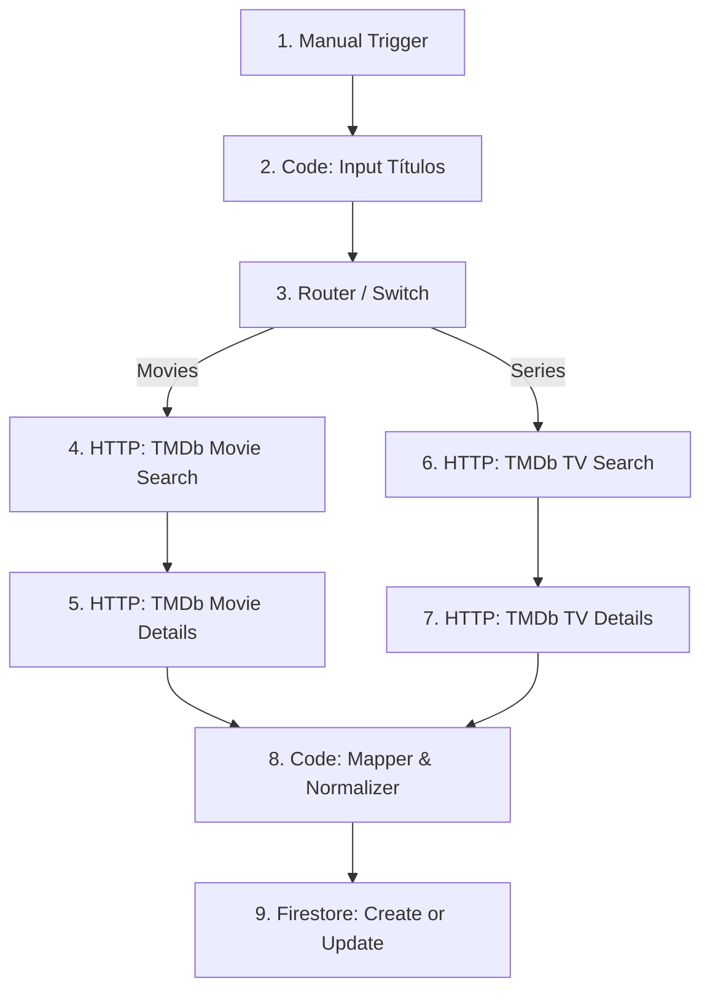

# Guía de Desarrollo Futuro - OST Levels (OSTPlay) 🚀

Esta guía detalla la hoja de ruta técnica y sugerencias para escalar **OST Levels** de un esqueleto inicial a un producto completo de producción.

---

## 🎵 1. Optimización y Compresión de Audio (Clave para Web)

El peso de los archivos de audio es crítico. Para garantizar tiempos de carga instantáneos e interactividad fluida:

### Formatos Recomendados
- **WebM / OPUS (Recomendado):** Es el códec moderno más eficiente para la web. Un audio comprimido en OPUS a **96 kbps** o incluso **64 kbps** mantiene una excelente calidad musical para auriculares de móvil y pesa menos de la mitad que un MP3 equivalente.
- **MP3 (Compatibilidad Universal):** Si usas MP3, comprímelo a un bitrate constante de **128 kbps** y remueve los metadatos innecesarios (ID3 tags, portadas integradas) que añaden bytes extra al archivo.

### Carga de Fragmentos Bajo Demanda
- En lugar de descargar una pista entera de 4 minutos cuando el usuario solo escuchará 2 segundos, puedes configurar el servidor o CDN para admitir **HTTP Range Requests** (por defecto soportado por Firebase Storage y Cloud Storage). Esto permite al navegador descargar únicamente los primeros bytes del archivo de audio, ahorrando un 95% de ancho de banda.

---

## 🗄️ 2. Base de Datos (Firebase Firestore & Storage)

Para alimentar el juego con cientos de niveles y una base de datos dinámica:

### Colección Firestore `levels`
```json
{
  "levelId": "lvl_001",
  "title": "Super Mario Bros. - Overworld Theme",
  "audioUrl": "https://firebasestorage.googleapis.com/.../mario.webm",
  "correctAnswers": [
    "super mario bros",
    "mario bros",
    "super mario"
  ],
  "hints": [
    "Es uno de los videojuegos de plataformas más icónicos de NES.",
    "El tema principal fue compuesto por Koji Kondo.",
    "Presenta al fontanero más famoso del mundo.",
    "El título contiene la palabra 'Super'."
  ]
}
```

### Tabla de Clasificación / Historial
Crea una colección `users` con el récord de racha de adivinanzas diarias para fomentar el juego social y competitivo.

---

## 🔍 3. Búsqueda Difusa (Fuzzy Search) y Autocompletado Avanzado

El autocompletado nativo `<datalist>` es básico. Para dar una experiencia premium, es recomendable reemplazarlo por un input inteligente utilizando **Fuse.js**:

- **¿Por qué Fuse.js?:** Permite realizar búsquedas difusas ("fuzzy search"). Si el usuario escribe `"zelda"` o comete una errata `"zleda"`, Fuse.js es capaz de puntuar y encontrar coincidencias como `"The Legend of Zelda"`.
- **Implementación:**
  1. Instala: `npm install fuse.js`
  2. Inicializa en el componente `guesser`:
     ```typescript
     import Fuse from 'fuse.js';
     const fuse = new Fuse(this.autocompleteOptions, {
       threshold: 0.4, // Grado de tolerancia a fallos
     });
     // Al escribir, filtra la lista:
     const results = fuse.search(inputVal);
     ```

---

## 🎮 4. Ideas de Gamification e Interfaz

Para aumentar la retención de usuarios:

- **Buscador de Respuestas Estilizado:** En lugar del menú desplegable por defecto del navegador, diseña un popup flotante con los logotipos de las consolas o portadas difuminadas de los juegos candidatos.
- **Rachas Diarias (Daily Streak):** Al igual que Wordle u Heardle, ofrece un único nivel al día. Si el usuario acierta, incrementa su racha diaria y permítele compartir su resultado en redes sociales usando emojis (ej. 🟥 🟥 🟩 ⬛ ⬛).
- **Efectos de Sonido:**
  - Sonido retro de "moneda" o campanas al acertar.
  - Efecto de estática de radio o zumbido al fallar un intento.
- **Visualizador de Espectro (Audio Visualizer):** Añade un visualizador de ondas de sonido con Canvas en el reproductor que se mueva dinámicamente con el ritmo de la música utilizando la API de Audio de Web (`AudioContext`).

---

## 🛠️ 5. Mejoras Pendientes para Producción Funcional

### 🔄 Orden de las Pistas Modificado
Ya hemos actualizado el código del componente `GameStatusComponent`. Ahora el orden de revelación al fallar los intentos queda configurado así:
* **Intento 1:** Solo audio (2s).
* **Intento 2 (Fallo 1):** Actores de la película.
* **Intento 3 (Fallo 2):** Director.
* **Intento 4 (Fallo 3):** Sinopsis/Trama de la película.
* **Intento 5 (Fallo 4):** Fotograma real (Frame) de la película (pista visual definitiva).

---

### ☁️ Hosting Gratuito de Imágenes (Evitar 300+ fotos locales)

Para no cargar la web con cientos de archivos de imagen pesados en tu repositorio de código, te sugerimos subir las imágenes a un servicio en la nube y utilizar sus URLs directas:

1. **The Movie Database (TMDb) API - *La opción inteligente e ilimitada*:**
   * **Cómo funciona:** En lugar de subir tú mismo las imágenes, puedes consumir la base de datos de películas más grande del mundo. Es completamente gratis y tiene todas las películas imaginables.
   * **Implementación:** Almacena en tu base de datos el ID de la película en TMDb (por ejemplo, `550` para Fight Club). Mediante una llamada rápida a su API, puedes obtener las URLs de sus carteles o fotogramas oficiales (`backdrops`) en diferentes resoluciones:
     `https://image.tmdb.org/t/p/w500/direct-image-path.jpg`
2. **Cloudinary (Plan Gratuito):**
   * **Almacenamiento:** Te ofrece 25 GB de almacenamiento y ancho de banda gratuito.
   * **Optimización:** Puedes subir las fotos reales y cambiar su tamaño o formato dinámicamente desde la propia URL (por ejemplo, recortarla o comprimirla a WebP automáticamente al solicitarla).
3. **Supabase Storage o Firebase Storage:**
   * **Firebase Storage** te da hasta 5 GB gratuitos. Puedes subir tus frames a una carpeta `frames/` y usar la URL pública del archivo.

---

### 🎵 Obtener Bandas Sonoras Online (Sin recursos locales)

Para las canciones, en lugar de descargar, recortar y subir archivos de audio manualmente a tu servidor, puedes obtener los fragmentos de audio directamente de servicios en línea de forma dinámica y gratuita:

1. **Deezer API o iTunes Search API - *La opción más rápida y 100% gratuita*:**
   * **Cómo funciona:** Ambos servicios ofrecen una API pública y gratuita que retorna un enlace directo a un fragmento de **30 segundos de previsualización (preview)** de cualquier canción oficial.
   * **Implementación:** Haces una consulta a la API de iTunes con el nombre de la película y el término "soundtrack". La API te devolverá un objeto JSON con una URL de audio `.m4a` de 30 segundos lista para reproducir en tu componente `<app-player>`.
   * **Ejemplo de consulta a iTunes (sin necesidad de API keys):**
     `https://itunes.apple.com/search?term=gladiator+soundtrack&media=music&limit=1`
2. **YouTube Audio Streaming (vía Proxys):**
   * Puedes usar APIs o proxys de YouTube para extraer únicamente el flujo de audio de un vídeo (como el tema principal) pasándole el ID del video de YouTube, aunque las APIs de Deezer/iTunes son mucho más estables y rápidas para cargar fragmentos cortos.
3. **Firebase Storage (Para audios personalizados):**
   * Si prefieres recortar tú mismo los efectos o versiones instrumentales específicas, puedes subirlas a tu **Firebase Storage** (dentro del límite gratuito de 5 GB). Los fragmentos de 30 segundos en formato OPUS/WebM pesan alrededor de 200 KB, lo que significa que podrías almacenar más de 25,000 canciones en el plan gratuito de Firebase.

---

### 🔑 Guía Paso a Paso para configurar tu Clave API de TMDb (Gratuito)

Para que la obtención de los fotogramas (frames) de las películas sea totalmente dinámica, sigue estos sencillos pasos:

1. **Crear una cuenta en TMDb:**
   * Entra en [themoviedb.org](https://www.themoviedb.org/) y haz clic en **Join TMDb** (Registrarse) para crear una cuenta gratuita.
2. **Solicitar tu API Key:**
   * Ve a la configuración de tu perfil haciendo clic en tu avatar en la esquina superior derecha y entra en **Settings** (Ajustes).
   * En el menú lateral izquierdo, haz clic en **API**.
   * Haz clic en **Create** (Crear) y selecciona el tipo de API **Developer** (Desarrollador).
   * Acepta los términos de servicio y rellena los datos básicos requeridos (nombre de tu aplicación, descripción breve y tus datos de contacto).
3. **Copiar tu API Key:**
   * Una vez enviada la información, verás tu sección de API actualizada.
   * Copia el string alfanumérico que aparece bajo el campo **API Key (v3 auth)**.
4. **Pegarla en la Aplicación:**
   * **Opción A (Interfaz):** Abre la aplicación en tu navegador y pégala en el campo de texto de la cabecera del dashboard. La app la recordará durante tu sesión de juego.
   * **Opción B (Código Permanente):** Para que quede guardada de forma permanente y no tener que ingresarla cada vez, abre el archivo [game-state.service.ts](file:///c:/Users/chakr/Desktop/Proyectos/OSTPlay/src/app/core/game-state.service.ts) y pégala en el signal `tmdbApiKey`:
     ```typescript
     tmdbApiKey = signal<string>('TU_API_KEY_AQUI');
     ```


6. poner opcion de series y peliculas tendremos dos pestañas la de series y la de peliculas con unas 500 niveles cada una.

---

## 🔌 7. Guía del Flujo n8n para Importación Masiva (Sin Spoilers) - Usando TMDb

Para garantizar una calidad de datos profesional, sin límites molestos y unificados, utilizaremos la API de **TMDb (The Movie Database)** tanto para películas como para series. Haremos una búsqueda para obtener el ID de la obra y luego una consulta de detalles que incluya los créditos (para actores y directores/creadores).

---

### 📦 Paso A: Configuración en la Consola de Firebase

Para que n8n sepa a qué cuenta e insertar los datos en el proyecto correcto, sigue estos pasos:

1. **Crear el Proyecto en Firebase:**
   * Abre [Firebase Console](https://console.firebase.google.com/).
   * Haz clic en **Agregar proyecto** (o selecciona uno existente). Nómbralo `OSTPlay`.
2. **Crear la Base de Datos Firestore:**
   * En el menú lateral, ve a **Firestore Database** (bajo la categoría *Bases de datos y almacenamiento* como se ve en tu captura).
   * Haz clic en **Crear base de datos**.
   * Elige **Comenzar en modo de prueba** (esencial para que n8n pueda escribir sin bloqueos iniciales).
   * Haz clic en **Habilitar**.
3. **Descargar la Clave de Credenciales (Service Account Key JSON):**
   * En la barra lateral izquierda, pasa el cursor sobre **Configuración** (icono de engranaje ⚙️) y haz clic en **Cuentas de servicio** (como se ve en la captura de tu menú flotante).
   * Haz clic abajo en el botón **Generar nueva clave privada**.
   * Se descargará un archivo `.json` en tu ordenador. Ábrelo con un editor de texto (Bloc de Notas, VS Code) y copia todo su contenido. **Este JSON es la firma digital que le dice a n8n exactamente en qué base de datos escribir.**

---

### 📐 Paso B: Estructura del Flujo de n8n

El flujo modificado para usar TMDb de forma unificada es el siguiente:



---

### ⚙️ Paso C: Configuración Nodo por Nodo en n8n

Sigue esta guía paso a paso para configurar o modificar tus nodos en n8n:

#### 1. Disparador Inicial (Manual Trigger)
* **¿Qué hace?:** Ejecuta el flujo cuando haces clic en el botón de probar en n8n.
* **Nodo en n8n:** Borra tu actual "Webhook" y pon en su lugar **When clicking 'Test workflow'** (también llamado *Manual Trigger*).

#### 2. Nodo Code: Input Títulos (JavaScript)
* **¿Qué hace?:** Define la lista de películas y series que quieres importar sin spoilers.
* **Configuración:**
  * **Language:** `JavaScript`
  * **Code:** Pega tu lista de películas y series estructuradas de esta forma:
    ```javascript
    return [
      // --- Películas ---
      { json: { nombre: "Titanic", categoria: "movies" } },
      { json: { nombre: "Gladiator", categoria: "movies" } },
      { json: { nombre: "Inception", categoria: "movies" } },
      // --- Series ---
      { json: { nombre: "Breaking Bad", categoria: "series" } },
      { json: { nombre: "Stranger Things", categoria: "series" } },
      { json: { nombre: "Game of Thrones", categoria: "series" } }
    ];
    ```

#### 3. Nodo Switch (Router)
* **¿Qué hace?:** Divide las películas y las series según la categoría.
* **Configuración:**
  * **Data Type:** `String`
  * **Value 1:** `{{ $json.categoria }}`
  * **Routing Rules:**
    * **Rule 1:** `Equal` -> `movies` -> Salida `0` (conéctala a la rama de búsqueda de películas).
    * **Rule 2:** `Equal` -> `series` -> Salida `1` (conéctala a la rama de búsqueda de series).

#### 4. Nodo HTTP Request: TMDb Movie Search (Conectado a la salida 0 del Switch)
* **¿Qué hace?:** Busca la película en la base de datos de TMDb usando su nombre para encontrar su ID.
* **Configuración:**
  * **Method:** `GET`
  * **URL:** `https://api.themoviedb.org/3/search/movie`
  * **Send Query Parameters:** Activo (añade estos parámetros abajo):
    * `query`: `{{ $json.nombre }}`
    * `api_key`: `TU_API_KEY_DE_TMDB` *(Consíguela en Settings -> API en themoviedb.org)*
    * `language`: `es`

#### 5. Nodo HTTP Request: TMDb Movie Details (Conectado a la salida de Movie Search)
* **¿Qué hace?:** Obtiene detalles adicionales como el reparto de actores y director a partir del ID de la película.
* **Configuración:**
  * **Method:** `GET`
  * **URL:** `https://api.themoviedb.org/3/movie/{{ $json.results[0]?.id }}`
  * **Send Query Parameters:** Activo:
    * `api_key`: `TU_API_KEY_DE_TMDB`
    * `language`: `es`
    * `append_to_response`: `credits`

#### 6. Nodo HTTP Request: TMDb TV Search (Conectado a la salida 1 del Switch)
* **¿Qué hace?:** Busca la serie en TMDb para encontrar su ID.
* **Configuración:**
  * **Method:** `GET`
  * **URL:** `https://api.themoviedb.org/3/search/tv`
  * **Send Query Parameters:** Activo:
    * `query`: `{{ $json.nombre }}`
    * `api_key`: `TU_API_KEY_DE_TMDB`
    * `language`: `es`

#### 7. Nodo HTTP Request: TMDb TV Details (Conectado a la salida de TV Search)
* **¿Qué hace?:** Obtiene el reparto de actores y los creadores a partir del ID de la serie.
* **Configuración:**
  * **Method:** `GET`
  * **URL:** `https://api.themoviedb.org/3/tv/{{ $json.results[0]?.id }}`
  * **Send Query Parameters:** Activo:
    * `api_key`: `TU_API_KEY_DE_TMDB`
    * `language`: `es`
    * `append_to_response`: `credits`

#### 8. Nodo Code (Normalizador de TMDb - JavaScript)
* **¿Qué hace?:** Conecta la salida de **ambos** nodos de Details (Movie y TV) a este nodo. Limpia los datos y los normaliza para tu base de datos.
* **Configuración:**
  * **Language:** `JavaScript`
  * **Code:**
    ```javascript
    return $input.all().map(item => {
      const data = item.json;
      
      // En TMDb, las películas usan 'title' y las series usan 'name'
      const isMovie = data.title !== undefined;
      const cleanTitle = isMovie ? data.title : data.name;
      const category = isMovie ? "movies" : "series";
      
      // Pistas
      const frameUrl = data.backdrop_path ? `https://image.tmdb.org/t/p/w780${data.backdrop_path}` : (data.poster_path ? `https://image.tmdb.org/t/p/w500${data.poster_path}` : "");
      const plot = data.overview || "Sinopsis no disponible";
      
      // Obtener director/creadores
      let director = "Información no disponible";
      if (isMovie) {
        if (data.credits && data.credits.crew) {
          const dirObj = data.credits.crew.find(c => c.job === 'Director');
          if (dirObj) director = dirObj.name;
        }
      } else {
        if (data.created_by && data.created_by.length > 0) {
          director = data.created_by.map(c => c.name).join(', ');
        } else if (data.credits && data.credits.crew) {
          const execObj = data.credits.crew.find(c => c.job === 'Executive Producer');
          if (execObj) director = execObj.name;
        }
      }
      
      // Obtener actores principales (top 3)
      let actors = "Reparto no disponible";
      if (data.credits && data.credits.cast) {
        actors = data.credits.cast.slice(0, 3).map(a => a.name).join(', ');
      }

      // Normalizar respuestas válidas
      const lowerTitle = cleanTitle.toLowerCase().trim();
      const correctAnswers = [lowerTitle];
      const articles = ['el ', 'la ', 'los ', 'las ', 'un ', 'una ', 'the ', 'a '];
      for (const art of articles) {
        if (lowerTitle.startsWith(art)) {
          correctAnswers.push(lowerTitle.substring(art.length));
          break;
        }
      }

      // Generar ID único limpio de acentos y caracteres raros
      const levelId = lowerTitle
        .normalize("NFD")
        .replace(/[\u0300-\u036f]/g, "")
        .replace(/[^a-z0-9]/g, '-')
        .replace(/-+/g, '-')
        .replace(/^-|-$/g, '');

      return {
        json: {
          levelId: levelId,
          category: category,
          title: cleanTitle,
          correctAnswers: correctAnswers,
          audioUrl: "", // Para iTunes en el frontend
          hints: {
            actors: actors,
            director: director,
            frameUrl: frameUrl,
            plot: plot
          }
        }
      };
    });
    ```

#### 9. Nodo Google Cloud Firestore (Acción: Create or update a document)
* **¿Qué hace?:** Guarda los datos normalizados en tu base de datos Firestore de forma automática.
* **Configuración:**
  * **Credential:** Selecciona *Create New Credential* -> *Service Account Key*. Pega el contenido JSON que descargaste de Firebase.
  * **Resource:** `Document`
  * **Operation:** `Create or update a document` *(la opción equivalente a Upsert)*.
  * **Collection:** `levels`
  * **Document ID:** `{{ $json.levelId }}`
  * **Data to Send:** `Define Below`
  * **Fields to Send:** En el campo que te permite pasar un JSON personalizado o definir los campos, puedes añadir directamente cada clave:
    * `levelId`: `{{ $json.levelId }}`
    * `category`: `{{ $json.category }}`
    * `title`: `{{ $json.title }}`
    * `correctAnswers`: `{{ $json.correctAnswers }}`
    * `audioUrl`: `{{ $json.audioUrl }}`
    * `hints`: `{{ JSON.stringify($json.hints) }}` (o mapeado campo por campo de hints).
    *(O si prefieres enviar todo el JSON completo estructurado, selecciona la opción de mandar JSON directamente y pon `{{ JSON.stringify($json) }}`)*.

---

Una vez que guardes y hagas clic en **Execute Workflow** en n8n, tu base de datos Firestore se poblará automáticamente con los 1000 niveles limpios y optimizados para consumir directamente en el código de Angular.
